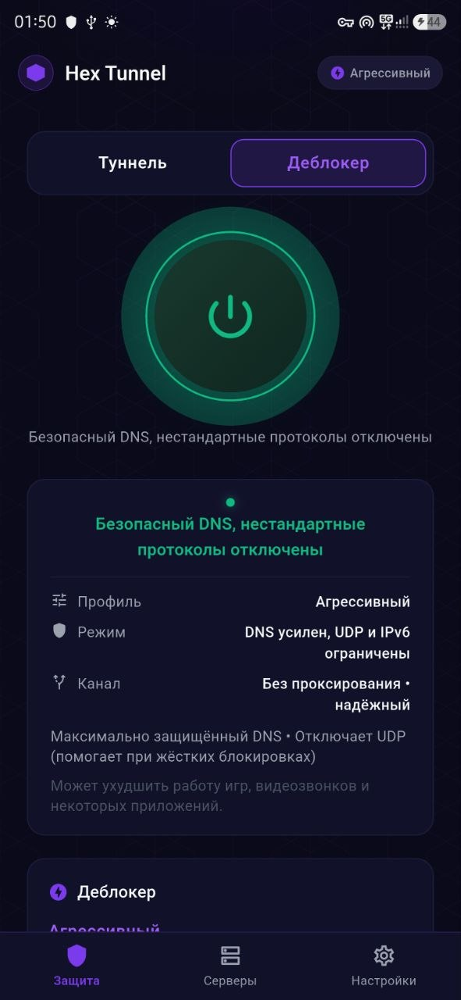
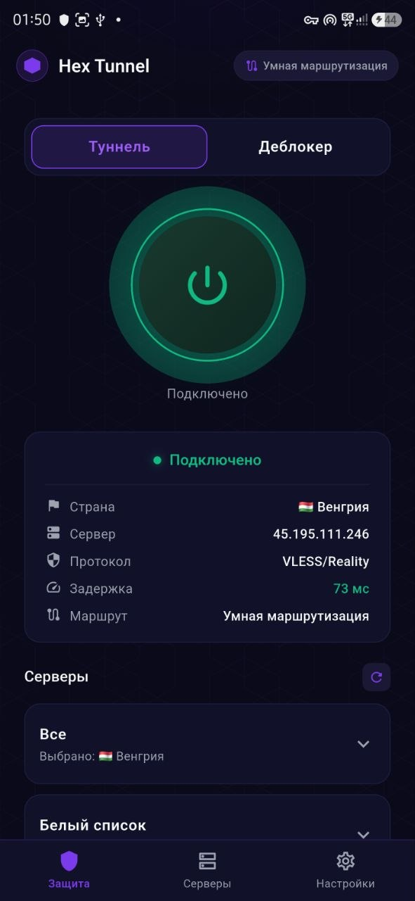
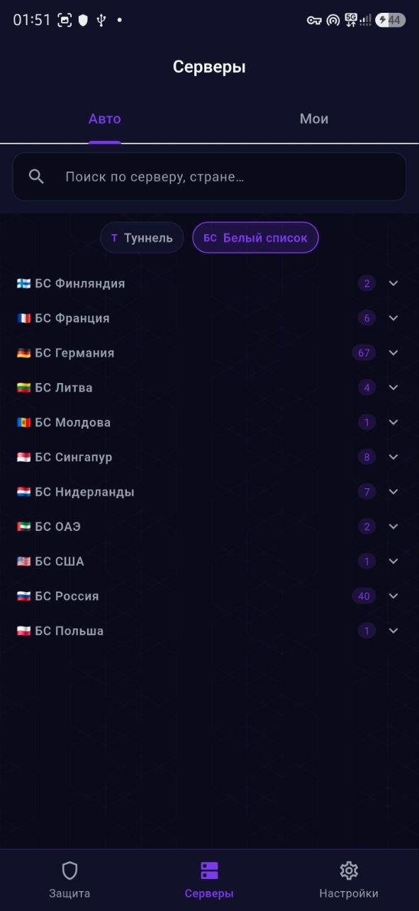
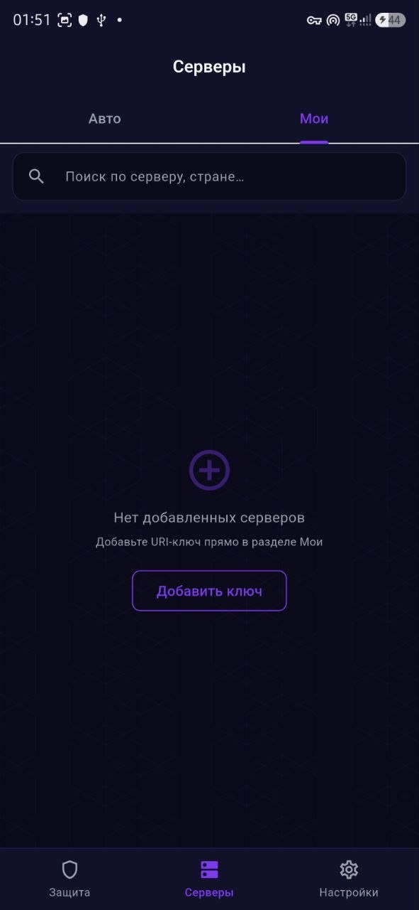
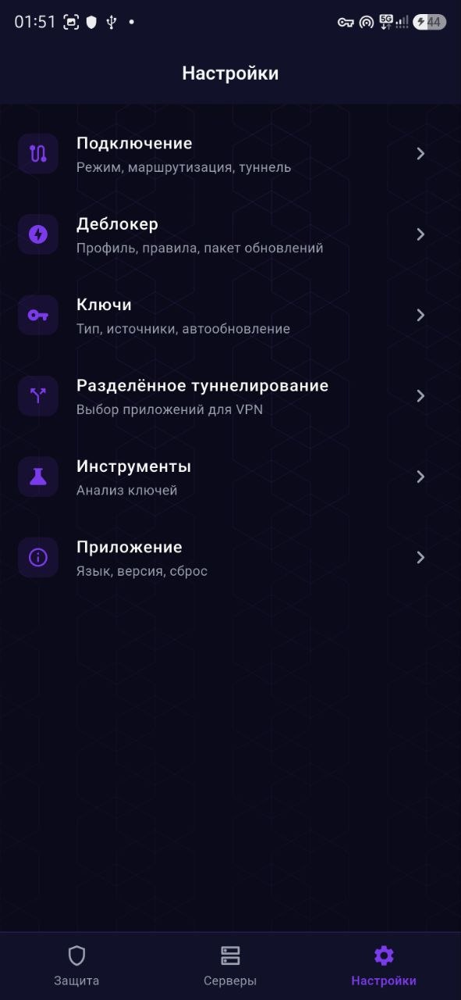
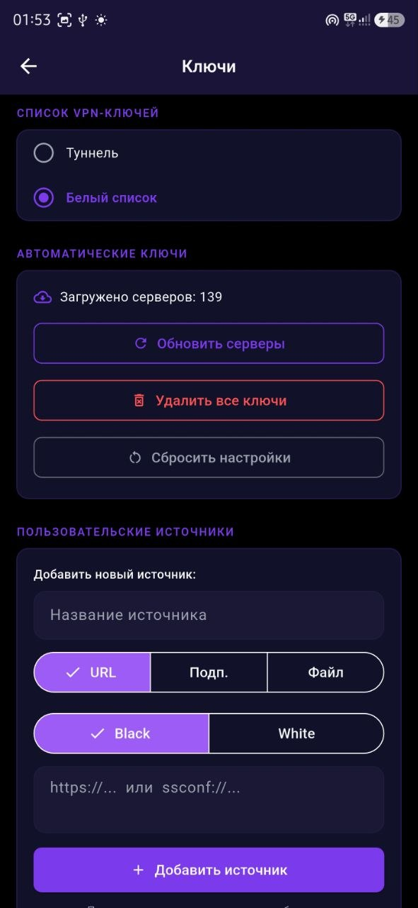
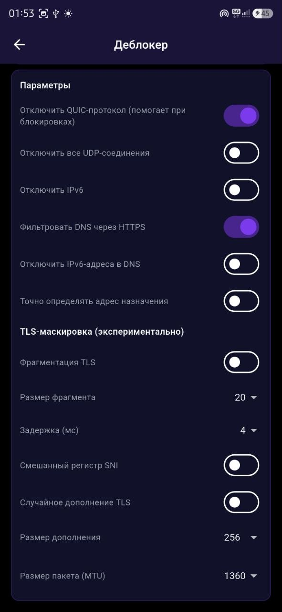

# Hex Tunnel 🛡️

**Hex Tunnel** is a high-performance Android VPN and proxy client designed specifically to bypass modern Deep Packet Inspection (DPI) and censorship systems. Powered by a customized `sing-box` core and advanced smart routing, Hex Tunnel provides seamless access to the free internet without sacrificing connection speed to local resources.

> **Note:** This project is provided for educational and non-commercial purposes under the Apache License 2.0 with the Commons Clause. Commercial use is strictly prohibited.

---

## 🌟 Key Features

*   **Smart Routing Engine**: Dynamically routes traffic based on huge, regularly updated domain datasets. Local traffic connects directly, while censored domains are tunneled transparently.
*   **Hybrid Legacy Mode (WARP)**: A built-in Cloudflare WARP integration that uses advanced `urltest` balancing to scan for unblocked IP/Port combinations (e.g., `500`, `4500`, `2408`), ensuring stable connectivity even during heavy DPI sweeps.
*   **Sing-box Core**: Built on the bleeding edge of proxy technology. Supports standard protocols (VLESS, VMess, Trojan, Shadowsocks) along with modern transport layers like Reality and ShadowTLS.
*   **Split Tunneling**: Easily exclude specific Android apps from the VPN tunnel to maintain native functionality (e.g., for local banking apps).
*   **Memory Optimized**: Handles huge routing rulesets efficiently using atomic file operations and lazy loading mechanisms to prevent OOM errors and unexpected EOF crashes.

## 📱 Screenshots

<p align="center">
  
  
  
  
</p>
<p align="center">
  
  
  
</p>


## 🚀 Getting Started

### Prerequisites

*   Flutter SDK (version 3.19 or higher)
*   Android Studio / Android SDK (API level 34+)
*   Dart 3.3+

### Building from Source

1.  **Clone the repository:**
    ```bash
    git clone https://github.com/yourusername/hex-tunnel.git
    cd hex-tunnel
    ```

2.  **Install dependencies:**
    ```bash
    flutter pub get
    ```

3.  **Build the Release APK:**
    To build an optimized, lightweight APK for Android ARM64 architecture:
    ```bash
    flutter build apk --release --target-platform android-arm64 --split-per-abi --obfuscate --split-debug-info=./debug_info
    ```
    The compiled APK will be located at `build/app/outputs/flutter-apk/app-arm64-v8a-release.apk`.

## ⚙️ Architecture

Hex Tunnel uses a Flutter frontend connected via Platform Channels to a customized Android `VpnService`. 
*   **Frontend**: Flutter / Dart
*   **Native Bridge**: Kotlin (`SingBoxBridge`, `HexVpnService`)
*   **Core Engine**: `libsingbox.so` (Golang)

### Routing Modes
- **Global**: All traffic is routed through the proxy.
- **Deblocker (Smart Routing)**: Traffic to blocked sites is routed through the proxy, while local traffic bypasses it.
- **Offline Deblock (Legacy WARP)**: Uses Cloudflare WARP with dynamic endpoint rotation to bypass standard protocol blocking.

## 🤝 Contributing

We welcome contributions from the community! Please read our [CONTRIBUTING.md](CONTRIBUTING.md) for details on our code of conduct, and the process for submitting pull requests to us.

## 📄 License

This project is licensed under the Apache License 2.0 with the Commons Clause. 
You are free to use, modify, and distribute the software for **non-commercial** purposes.
See the [LICENSE](LICENSE) file for complete details.
